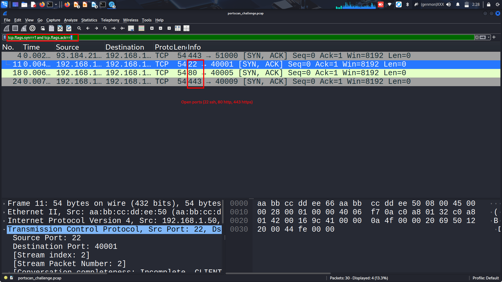
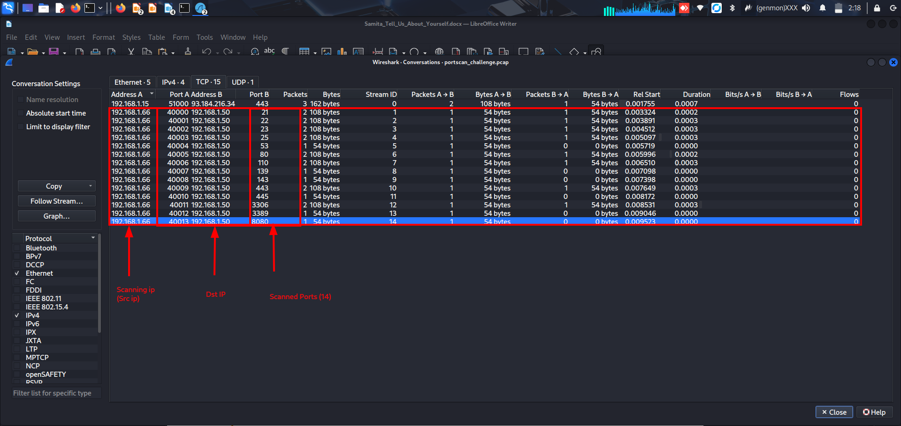
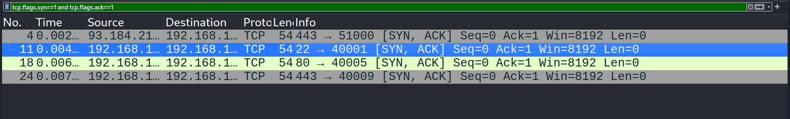

# 🔍 Port Scan Analysis with Wireshark

A walkthrough of analyzing a TCP port scan capture (`portscan_challenge.pcap`) to identify the attacker, the target, and which ports were left open. Done entirely in Wireshark by reading TCP flags — no Nmap output required, just the raw handshake packets.

> 📌 **Credit:** the `portscan_challenge.pcap` file used in this walkthrough was originally posted as a public challenge by [Cybershujaa](https://www.linkedin.com/feed/update/urn:li:activity:7476499563995070464/) on LinkedIn. All analysis, screenshots, and write-up below are my own.

## 📁 Files in this repo

- `portscan_challenge.pcap` — the capture file analyzed
- `screenshots/` — Wireshark views referenced below

## 🎯 The Goal

Given a packet capture, answer:
1. Who's doing the scanning?
2. Who's being scanned?
3. How many ports were targeted?
4. Which ports came back open?

## Step 1: Get the lay of the land with Conversations view

First stop in any pcap analysis — **Statistics → Conversations → TCP tab**. This gives you a bird's-eye view of every conversation in the capture without having to scroll packet-by-packet.



This single view answered three of my four questions immediately:

- **Scanning IP (Address A):** `192.168.1.66` — same source IP shows up over and over, each time pairing with a different destination port
- **Target IP (Address B):** `192.168.1.50` — same destination IP every time
- **Ports targeted:** 14 unique ports — `21, 22, 23, 25, 53, 80, 110, 139, 143, 443, 445, 3306, 3389, 8080`

The pattern is the giveaway: one IP, sequential source ports (40000, 40001, 40002...), hitting a long list of well-known service ports on the same destination, all within milliseconds. That's not normal user traffic — that's a port scanner (Nmap or similar) doing its job.

> 💡 **Side note:** there's also a `192.168.1.15 ↔ 93.184.216.34` conversation on port 443 in the capture. That's unrelated background traffic (a normal HTTPS session) that happened to get captured in the same file — not part of the scan. Worth flagging so it doesn't get mistakenly counted as a scanned port.

## Step 2: Figure out which ports are actually open

Knowing *which* ports were probed isn't the same as knowing which ones are *open*. For that, you need to look at how the target responded — and that comes down to TCP flags.

### Quick refresher: how a TCP handshake normally works

| Step | Who sends it | Flags set |
|---|---|---|
| 1 | Client → Server | `SYN` only |
| 2 | Server → Client | `SYN` + `ACK` |
| 3 | Client → Server | `ACK` only |

The handshake only gets to step 2 if something is actually listening on that port. So:

| Target's response | What it means |
|---|---|
| **SYN + ACK** | Port is **open** — a service answered |
| **RST + ACK** | Port is **closed** — host is up, nothing listening |
| **No response** | Port is likely **filtered** (firewall dropped it silently) |

### Applying the filter

In the Wireshark filter bar:

```
tcp.flags.syn==1 and tcp.flags.ack==1
```

This says: "only show me packets where both the SYN flag AND the ACK flag are set to 1." That combination only happens at step 2 of the handshake above — i.e., a port confirming it's open.



Four rows matched. But only **three** of them are actually part of the scan:

| Frame | Source | Port | Part of the scan? |
|---|---|---|---|
| 4 | 93.184.216.34 | 443 | ❌ No — this is the unrelated background HTTPS session |
| 11 | 192.168.1.50 | 22 | ✅ Yes |
| 18 | 192.168.1.50 | 80 | ✅ Yes |
| 24 | 192.168.1.50 | 443 | ✅ Yes |

So the real result: **ports 22 (SSH), 80 (HTTP), and 443 (HTTPS) were open** on the target.

### Double-checking by hand

Filters are great, but it's worth knowing how to confirm this manually too — just in case a filter typo gives you a false sense of confidence. Click into any individual packet and expand the **Transmission Control Protocol** section in the details pane:



Here, frame 11 shows `Source Port: 22`, and further down in the flags field both the SYN and ACK bits are set — confirming by hand exactly what the filter told us. This is a good habit: let the filter narrow things down, then manually verify at least one or two results so you're not just trusting the tool blindly.

## ✅ Final Answers

| Question | Answer |
|---|---|
| Scanning IP | `192.168.1.66` |
| Target IP | `192.168.1.50` |
| Ports targeted | 14 (`21, 22, 23, 25, 53, 80, 110, 139, 143, 443, 445, 3306, 3389, 8080`) |
| Open ports | `22` (SSH), `80` (HTTP), `443` (HTTPS) |

## 🧠 Key Takeaways

- A burst of SYN packets from one IP to many ports on another IP, all within milliseconds, is a classic port scan signature — even without seeing the scanning tool's own output.
- `tcp.flags.syn==1 and tcp.flags.ack==0` isolates the **scan attempts** (the outgoing probes).
- `tcp.flags.syn==1 and tcp.flags.ack==1` isolates the **open port confirmations** (the replies).
- Always sanity-check filter results against the actual source/destination IPs — a filter can technically match packets that have nothing to do with the incident you're investigating, like the unrelated HTTPS conversation in this capture.
- Manually inspecting at least one packet's flags in the details pane is good practice to confirm what a filter is telling you.

---

*Lab capture analyzed in Wireshark. Part of my ongoing SOC Analyst training and hands-on packet analysis practice.*
